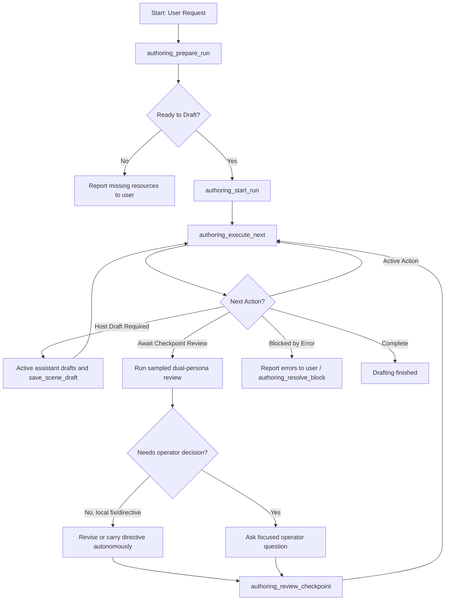

# Spindle Authoring Supervisor

The Spindle Authoring Supervisor is an MCP-native authoring pipeline that enables an interactive, agent-driven long-form drafting workflow. It manages the multi-step drafting, verification, review, and checkpoint loop safely while synchronizing the run state in a SQLite database.

The default authoring posture is autonomous quality supervision: the active
assistant should keep writing and improving prose without asking the operator to
approve every local craft decision. Checkpoints are still hard quality gates,
but reviewer findings are treated as instructions to improve the manuscript,
not as a prompt for permission. The assistant should fix or carry forward
findings automatically unless the review requires a plot, canon,
content-boundary, relationship, or author-intent decision.

## Architecture & Database Schema

Unlike the traditional CLI-based `spindle-harness` which relies on external harness state files, the Authoring Supervisor persists run states directly in the SQLite database to facilitate robust resumes, state tracking, and integration with the MCP tool router.

The tables defined in migration `V0007__authoring_runs.sql` are:

1. **`authoring_run`**: Stores metadata for the overall multi-chapter drafting run, including the project, active branch, start/end chapters, checkpoint intervals, editorial directives, status, and timestamps.
2. **`authoring_run_chapter`**: Tracks chapter-level progress, plans, synopses, POV character assignments, status, and summary artifacts.
3. **`authoring_run_scene`**: Tracks scene-level progress, including the participating characters, location, content rating, phase (`pending`, `draft_saved`, `changes_committed`, `beats_annotated`), scene ID, and artifact paths.
4. **`authoring_checkpoint`**: Tracks checkpoint ranges, statuses (`pending_review`, `reviewed`), and report artifact paths.

## MCP Tools Interface

The supervisor exposes 7 new MCP tools through the `spindle-mcp` server:

| Tool Name | Description | Key Input Fields | Key Output Fields |
|---|---|---|---|
| `authoring_prepare_run` | Verifies plans and resources are ready before drafting. | `project_id`, `book_number`, `start_chapter`, `end_chapter` | `ready_to_draft`, `missing_requirements` |
| `authoring_start_run` | Initializes a new authoring run. | `project_id`, `book_number`, `start_chapter`, `end_chapter`, `checkpoint_interval` | `run_id`, `status` |
| `authoring_status` | Retrieves status and next actions of the active run. | `project_id`, `run_id` (optional) | `status`, `next_action`, `blocked_reason`, `chapters` |
| `authoring_execute_next` | Advances exactly one bounded drafting/commit/checkpoint action. Default mode is interactive/hybrid: non-explicit draft steps return host-draft instructions instead of calling the draft route. | `project_id`, `run_id`, `mode` (optional; use `"agent"` only for intentional full offload) | `run_id`, `executed_action`, `next_action`, `status` |
| `authoring_review_checkpoint` | Marks a checkpoint reviewed and appends directives to resume. | `project_id`, `run_id`, `start_chapter`, `end_chapter`, `directives` | `run_id`, `status` |
| `authoring_resolve_block` | Clears a blocked scene after operator inspection and advances it to the next safe phase. | `project_id`, `run_id`, `chapter_number`, `scene_order`, `target_phase` | `run_id`, `status` |
| `authoring_cancel_run` | Pauses or cancels the active run without deleting progress. | `project_id`, `run_id` | `run_id`, `status` |

Chapter plans are the source of truth for pre-draft scene requirements. Each
`plan_chapter` scene should carry first-class `character_ids`, `location_id`,
and `content_rating` fields. `authoring_prepare_run` still accepts old plans
that encoded `location:` / `rating:` in summary text as a legacy fallback, but
new supervisor flows should not depend on that parsing convention.

## Interactive Drafting Workflow

An agent driving the drafting run executes the following loop:

### Checkpoint Review Policy

When a run reaches `await_checkpoint_review`, the supervisor should inspect the
checkpoint report and run any missing sampled dual-persona reviews with
`rounds: 2`. The checkpoint cannot be closed until those sampled reviews are
current in the local database.

After the review:

- For local craft issues such as missing sensory grounding, repetition,
  weak line phrasing, pacing trim, filter words, or scene-specific UI/prose
  punch-up, the assistant should revise the scene itself and rerun the relevant
  review/check steps before approving the checkpoint.
- For feedback that should shape later chapters but does not require changing
  completed prose, approve the checkpoint with clear directives.
- For plot, canon, content-boundary, relationship-direction, or author-intent
  choices, ask the operator a focused question instead of guessing.

The supervisor should not ask "revise or approve?" for reviewer findings it can
address without changing author intent. It should choose the quality path and
continue the run.

### Resuming an Interrupted Run
If the session or service restarts mid-run:
1. Call `authoring_status` to fetch the active run.
2. If the status is `"blocked"` with reason `"await_checkpoint_review"`, inspect the checkpoint report, run any missing sampled dual-persona reviews, resolve local fixes/directives, then call `authoring_review_checkpoint`.
3. Call `authoring_execute_next` to continue driving the drafting loop.

Run statuses are `"active"`, `"blocked"`, `"completed"`, or `"paused"`. `authoring_cancel_run` sets `"paused"` and `authoring_execute_next` will not advance a paused run.

### Draft Routing Semantics

By default, `authoring_execute_next` is intended for the natural MCP/chat
workflow: the active assistant writes General, Teen, and Mature prose using
Spindle context, then saves it with `save_scene_draft`. This keeps the primary
writing voice in the current conversation. Explicit scenes may still route
through the explicit-capable backend configured for the project.

`mode: "agent"` is an explicit opt-in for fully automated tests or batch runs.
In that mode, Spindle routes non-explicit scenes through the configured `draft`
route too. Do not use it for normal interactive writing unless the operator
asks for full offload.
