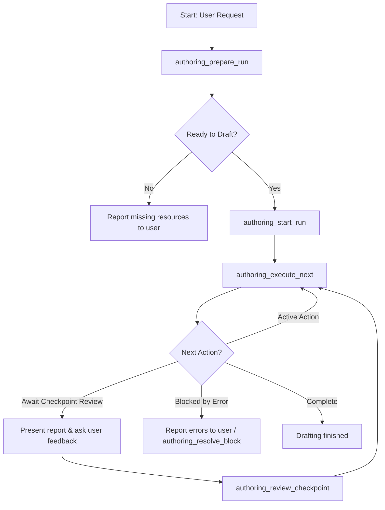

# Spindle Authoring Supervisor

The Spindle Authoring Supervisor is an MCP-native authoring pipeline that enables an interactive, agent-driven long-form drafting workflow. It manages the multi-step drafting, verification, review, and checkpoint loop safely while synchronizing the run state in a SQLite database.

## Architecture & Database Schema

Unlike the traditional CLI-based `spindle-harness` which relies on external harness state files, the Authoring Supervisor persists run states directly in the SQLite database to facilitate robust resumes, state tracking, and integration with the MCP tool router.

The tables defined in migration `V0007__authoring_runs.sql` are:

1. **`authoring_run`**: Stores metadata for the overall multi-chapter drafting run, including the project, active branch, start/end chapters, checkpoint intervals, editorial directives, status, and timestamps.
2. **`authoring_run_chapter`**: Tracks chapter-level progress, plans, synopses, POV character assignments, status, and summary artifacts.
3. **`authoring_run_scene`**: Tracks scene-level progress, including the participating characters, location, content rating, phase (`pending`, `draft_saved`, `changes_committed`, `beats_annotated`), scene ID, and artifact paths.
4. **`authoring_checkpoint`**: Tracks checkpoint ranges, statuses (`pending_review`, `reviewed`), and report artifact paths.

## MCP Tools Interface

The supervisor exposes 7 new MCP tools through the `spindle-mcp` server:

| Tool Name | Description | Key Input Fields | Key Output Fields |
|---|---|---|---|
| `authoring_prepare_run` | Verifies plans and resources are ready before drafting. | `project_id`, `book_number`, `start_chapter`, `end_chapter` | `ready_to_draft`, `missing_requirements` |
| `authoring_start_run` | Initializes a new authoring run. | `project_id`, `book_number`, `start_chapter`, `end_chapter`, `checkpoint_interval` | `run_id`, `status` |
| `authoring_status` | Retrieves status and next actions of the active run. | `project_id`, `run_id` (optional) | `status`, `next_action`, `blocked_reason`, `chapters` |
| `authoring_execute_next` | Executes exactly one bounded drafting/commit/checkpoint action. | `project_id`, `run_id` | `run_id`, `executed_action`, `next_action`, `status` |
| `authoring_review_checkpoint` | Marks a checkpoint reviewed and appends directives to resume. | `project_id`, `run_id`, `start_chapter`, `end_chapter`, `directives` | `run_id`, `status` |
| `authoring_resolve_block` | Clears a blocked scene after operator inspection and advances it to the next safe phase. | `project_id`, `run_id`, `chapter_number`, `scene_order`, `target_phase` | `run_id`, `status` |
| `authoring_cancel_run` | Pauses or cancels the active run without deleting progress. | `project_id`, `run_id` | `run_id`, `status` |

Chapter plans are the source of truth for pre-draft scene requirements. Each
`plan_chapter` scene should carry first-class `character_ids`, `location_id`,
and `content_rating` fields. `authoring_prepare_run` still accepts old plans
that encoded `location:` / `rating:` in summary text as a legacy fallback, but
new supervisor flows should not depend on that parsing convention.

## Interactive Drafting Workflow

An agent driving the drafting run executes the following loop:

### Resuming an Interrupted Run
If the session or service restarts mid-run:
1. Call `authoring_status` to fetch the active run.
2. If the status is `"blocked"` with reason `"await_checkpoint_review"`, call `authoring_review_checkpoint` first.
3. Call `authoring_execute_next` to continue driving the drafting loop.

Run statuses are `"active"`, `"blocked"`, `"completed"`, or `"paused"`. `authoring_cancel_run` sets `"paused"` and `authoring_execute_next` will not advance a paused run.
