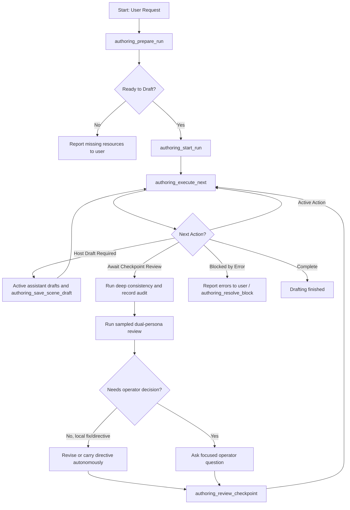

# Spindle Authoring Supervisor

The Spindle Authoring Supervisor is an MCP-native authoring pipeline that enables an interactive, agent-driven long-form drafting workflow. It manages the multi-step drafting, verification, review, and checkpoint loop safely while synchronizing the run state in a SQLite database.

The default authoring posture is autonomous quality supervision: the active
assistant should keep writing and improving prose without asking the operator to
approve every local craft decision. Checkpoints are still hard quality gates,
but reviewer findings are treated as instructions to improve the manuscript,
not as a prompt for permission. The assistant should fix or carry forward
findings automatically unless the review requires a plot, canon,
content-boundary, relationship, or author-intent decision.

## Architecture & Database Schema

Unlike the traditional CLI-based `spindle-harness` which relies on external harness state files, the Authoring Supervisor persists run states directly in the SQLite database to facilitate robust resumes, state tracking, and integration with the MCP tool router.

The tables defined in migration `V0007__authoring_runs.sql` are:

1. **`authoring_run`**: Stores metadata for the overall multi-chapter drafting run, including the project, active branch, start/end chapters, checkpoint intervals, editorial directives, status, and timestamps.
2. **`authoring_run_chapter`**: Tracks chapter-level progress, plans, synopses, POV character assignments, status, and summary artifacts.
3. **`authoring_run_scene`**: Tracks scene-level progress, including the participating characters, location, content rating, phase (`pending`, `draft_saved`, `changes_committed`, `beats_annotated`), scene ID, and artifact paths.
4. **`authoring_checkpoint`**: Tracks checkpoint ranges, statuses (`pending_review`, `reviewed`), and report artifact paths.

## MCP Tools Interface

The supervisor exposes 9 MCP tools through the `spindle-mcp` server:

| Tool Name | Description | Key Input Fields | Key Output Fields |
|---|---|---|---|
| `authoring_prepare_run` | Verifies plans and resources are ready before drafting. | `project_id`, `book_number`, `start_chapter`, `end_chapter` | `ready_to_draft`, `missing_requirements` |
| `authoring_start_run` | Initializes a new authoring run. | `project_id`, `book_number`, `start_chapter`, `end_chapter`, `checkpoint_interval`, `mining_policy` (optional; `disabled` default or `propose_all`), `max_revise_attempts` (optional; `0` default, `1` or `2` to enable in-run verify/revise) | `run_id`, `status` |
| `authoring_status` | Retrieves status and next actions of the active run. | `project_id`, `run_id` (optional) | `status`, `next_action`, `blocked_reason`, `chapters` |
| `authoring_execute_next` | Advances exactly one bounded drafting/commit/checkpoint action. Default mode is interactive/hybrid: non-explicit draft steps return host-draft instructions instead of calling the draft route. | `project_id`, `run_id`, `mode` (optional; use `"agent"` only for intentional full offload) | `run_id`, `executed_action`, `next_action`, `status` |
| `authoring_save_scene_draft` | Saves host-drafted prose plus its required structured continuity package. | `project_id`, `run_id`, scene placement, `full_text`, `summary`, `character_states`, `canonical_facts`, `relationship_updates`, `beats`, `continuity_notes` | `run_id`, `scene_id`, `scene_artifact_path`, `structured_update_count` |
| `authoring_record_checkpoint_audit` | Attaches the deep consistency result returned by a separate `check_consistency(deep_check=true)` call to a pending checkpoint. | `project_id`, `run_id`, `start_chapter`, `end_chapter`, `deep_consistency` | `run_id`, `status` |
| `authoring_review_checkpoint` | Marks a checkpoint reviewed and appends directives to resume. | `project_id`, `run_id`, `start_chapter`, `end_chapter`, `directives` | `run_id`, `status` |
| `authoring_resolve_block` | Clears a blocked scene after operator inspection and advances it to the next safe phase. | `project_id`, `run_id`, `chapter_number`, `scene_order`, `target_phase` | `run_id`, `status` |
| `authoring_cancel_run` | Pauses or cancels the active run without deleting progress. | `project_id`, `run_id` | `run_id`, `status` |

Chapter plans are the source of truth for pre-draft scene requirements. Each
`plan_chapter` scene should carry first-class `character_ids`, `location_id`,
and `content_rating` fields. `authoring_prepare_run` still accepts old plans
that encoded `location:` / `rating:` in summary text as a legacy fallback, but
new supervisor flows should not depend on that parsing convention.

`mining_policy` on `authoring_start_run` is optional and defaults to `disabled`
(a run that never opts in behaves exactly as before). Set it to `propose_all`
to insert an automatic `mine canon` step between `commit scene changes` and
`annotate beats`: each committed scene is mined into proposed canon deltas the
operator ratifies via the canon-delta flow (`list_canon_deltas` /
`decide_canon_deltas`). The mining outcome is recorded honestly per scene in
`authoring_status` as `mine_status` (`staged` | `skipped` |
`model_output_rejected` | `error`) plus a `mine_detail` — a skip or error never
reads as a clean mine, and mining never blocks the run. When `propose_all` is
in play, `authoring_prepare_run` (called with the same `mining_policy`) also
verifies the mine-or-review route ladder covers every planned rating and reports
`missing_requirements` when it cannot, so an offload gap fails at prepare rather
than mid-run. `authoring_prepare_run`'s optional `mining_policy` input drives
this extra preflight and defaults to skipping it.

`max_revise_attempts` on `authoring_start_run` is optional and defaults to `0`
(disabled — a run that never opts in behaves exactly as before: a saved draft
goes straight to `commit scene changes`). Set it to `1` or `2` (a bound; higher
values are rejected as an input error) to insert a deterministic `verify scene`
step between `draft` and `commit`. Verify runs the scene-scoped check subset
(`SCENE_VERIFY_CHECKS`, no model calls); a finding at or above `warning` sends
the scene back to the same draft route as a bounded `revise scene (attempt N)`
(in hybrid mode `authoring_execute_next` instead returns a "Host revision
required" instruction listing the findings, and the host re-saves via
`authoring_save_scene_draft`, which resets the verify state and counts the
attempt). The outcome is recorded honestly per scene in `authoring_status` as
`verify_status` (`clean` | `findings` | `parked_findings` | `error`),
`verify_detail`, and `revise_attempts`. The loop converges or stops: a re-verify
with an unchanged finding set parks the scene (`parked_findings`, "unchanged
after revision") rather than re-revising the same findings, and any parked
findings inherit to the checkpoint. Verify is deterministic and revision reuses
the already-preflighted draft route, so `authoring_prepare_run` adds **no** extra
coverage check for this policy; verify never blocks the run.

## Interactive Drafting Workflow

An agent driving the drafting run executes the following loop:

### Checkpoint Review Policy

When a run reaches `await_checkpoint_review`, the supervisor should inspect the
checkpoint report. If deep consistency is pending, run `check_consistency` for
that chapter range with `deep_check: true`, then call
`authoring_record_checkpoint_audit` with the returned structured payload. Then
run any missing sampled dual-persona reviews with `rounds: 2`. The checkpoint
cannot be closed until the deep audit is recorded and sampled reviews are
current in the local database.

After the review:

- For local craft issues such as missing sensory grounding, repetition,
  weak line phrasing, pacing trim, filter words, scene-specific UI/prose
  punch-up, missing expected LitRPG/system markup, or required reward/result UI
  blocks, the assistant should revise the scene itself and rerun the relevant
  review/check steps before approving the checkpoint.
- For feedback that should shape later chapters but does not require changing
  completed prose, approve the checkpoint with clear directives.
- For plot, canon, content-boundary, relationship-direction, or author-intent
  choices, ask the operator a focused question instead of guessing.

The supervisor should not ask "revise or approve?" for reviewer findings it can
address without changing author intent. It should choose the quality path and
continue the run.

### Resuming an Interrupted Run
If the session or service restarts mid-run:
1. Call `authoring_status` to fetch the active run.
2. If the status is `"blocked"` with reason `"await_checkpoint_review"`, inspect the checkpoint report, run/record any pending deep consistency audit, run any missing sampled dual-persona reviews, resolve local fixes/directives, then call `authoring_review_checkpoint`.
3. Call `authoring_execute_next` to continue driving the drafting loop.

Run statuses are `"active"`, `"blocked"`, `"completed"`, or `"paused"`. `authoring_cancel_run` sets `"paused"` and `authoring_execute_next` will not advance a paused run.

### Draft Routing Semantics

By default, `authoring_execute_next` is intended for the natural MCP/chat
workflow: the active assistant writes General, Teen, and Mature prose using
Spindle context, then saves it with `authoring_save_scene_draft`. This keeps
the primary writing voice in the current conversation while requiring the same
structured continuity package as offloaded drafting. Explicit scenes may still
route through the explicit-capable backend configured for the project.

`authoring_save_scene_draft` requires at least one structured continuity entry:
`character_states`, `canonical_facts`, `relationship_updates`, `beats`, or
`continuity_notes`. If the scene introduces no durable canon changes, record
that explicitly in `continuity_notes`.

`mode: "agent"` is an explicit opt-in for fully automated tests or batch runs.
In that mode, Spindle routes non-explicit scenes through the configured `draft`
route too. Do not use it for normal interactive writing unless the operator
asks for full offload.

### Explicit-content offload guarantee

Every automated pass that carries scene prose — drafting, in-run revision,
canon mining, and (once enabled) review/reader-sim automation — resolves its
route through the single rating-gated chokepoint. A scene's prose is never
dispatched to a model whose agent does not declare the scene's content rating.
When a pass cannot serve a rating it **skips honestly** rather than downgrading:
the mine step records `mine_status: "skipped"` naming the rating and emits a
`pass_skipped` journal event; the run advances anyway (skips never block). The
in-run verify step is deterministic (no model call), so it carries no leakage
risk, and the journal carries ids/counts only — never prose. The checkpoint
samples the last scene in the range, so an interleaved explicit scene is not
routed to review by the default flow. This whole guarantee is pinned by an
integration test that drives a `general` + `explicit` run whose `mine` route
resolves only to a non-explicit agent and asserts, against a post-gate dispatch
recorder, that no request containing the explicit scene's prose or brief ever
reached the uncleared agent (evolution design §4).

## Run journal (observability)

Each authoring run appends an **append-only event journal** as it advances —
one row per observable transition (draft, verify, revise, commit, mine, annotate,
chapter summary, checkpoint create/block/review, and run status changes). The
journal is the *timeline view*; `authoring_status` (the run tables) remains the
source of truth. A journaling error never fails a run step — it logs at `warn`
and the run proceeds — so the journal is an honest-but-not-guaranteed-complete
record.

The kind vocabulary and payload shapes are a one-way door, fixed by
[ADR 0002](adr/0002-authoring-run-event-journal.md) (§D2 lists every kind and its
payload keys). Payloads carry **ids, artifact paths, counts, and enums only —
never prose, fact text, evidence, or model output** (ADR §D3.1), so the stream
is safe to leave open on a shared screen. Consumers must ignore unknown kinds and
unknown payload keys (additive-evolution rule, ADR §D3.2); the P3/P4 kinds in the
ADR table are reserved and do not occur until those phases land.

### Streaming over SSE

The journal streams over the existing HTTP surface at
`GET /events?topic=run:<authoring_run_id>`:

- Each SSE frame carries `id` = the event `seq`, `event` = the kind, and `data`
  = the payload JSON.
- Replay resumes exactly from `Last-Event-ID`: the server replays rows with
  `seq > Last-Event-ID`, then follows live appends (polled on the snapshot
  cadence). `seq` is dense and 1-based per run, so resume is exact.
- `GET /events` with **no** `topic` param is unchanged: it streams the existing
  model-routes snapshot. A malformed topic (unknown scheme or an id that is not a
  well-formed `authoring_run:` id) returns `400`. A well-formed run id with no
  events is a valid empty stream (no existence check).
