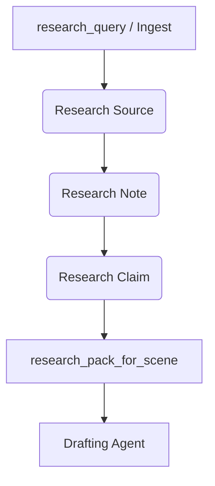

# Spindle Research Subsystem

This document describes the design, routing mechanisms, safety boundaries, and ingest workflows of Spindle's project-local Research Subsystem.

## Architecture & Core Principle

The Research Subsystem is a project-local research library backed by SQLite (stored at `.spindle/spindle.db`).

**Core Principle:** Research agents do not write story prose. They gather, summarize, tag, cite, and store factual research to serve scene drafting. Explicit/adult research is allowed only as factual, sourced, adult-only context, and is kept separate from general/non-explicit drafting.



## Config Routing (`route = "research"`)

Support for the `"research"` route is fully integrated with the model router configuration in project-local `.spindle/config.toml` (or an explicit `SPINDLE_CONFIG` override).

### Configuration Example

```toml
[[agents]]
id = "general-research"
name = "General research model"
provider = "openai-compatible"
endpoint = "http://localhost:11434/v1"
model = "research-model"
api_key_env = "RESEARCH_API_KEY"

[[agents]]
id = "explicit-research"
name = "Explicit/adult factual research model"
provider = "grok-cli"
endpoint = "grok"
model = "grok-build"
ratings = ["safe", "mature", "explicit"]
agent_profile = "spindle-researcher"

[[routing]]
route = "research"
agent = "general-research"

[[routing]]
route = "research"
agent = "explicit-research"
rating = "explicit"
```

## 1970s Las Vegas Book Example

Below are practical research queries for a historical fiction project set in 1970s Las Vegas:

### 1. General Research Query
- **Query:** "casino culture, hotel labor unions, music venues, and organized crime influence in 1970s Las Vegas"
- **Behavior:** Routed to the `general-research` agent.
- **Factual result saved:**
  - **Source:** "The Battle for Las Vegas: The Law vs. The Mob"
  - **Note:** "Mob ownership of casinos was heavily targeted by the FBI and Nevada Gaming Control Board throughout the 1970s."
  - **Claim:** "Federal investigators increased pressure on casino skim operations in the mid-1970s." (confidence: verified)

### 2. Explicit/Adult Factual Query
- **Query:** "adult entertainment laws, social boundaries, and adult-only showgirl culture in 1970s Las Vegas"
- **Behavior:** Routed to the `explicit-research` agent (with `rating = "explicit"`). If no explicit research route is configured, Spindle fails closed instead of using the default research route.
- **Factual result saved:**
  - **Source:** "Las Vegas Showgirl History & Culture"
  - **Note:** "Showgirl entertainment in the 1970s transitioned to include both topless show performances and family-friendly spectacles, separated by strict venue/gaming room zoning."
  - **Claim:** "Topless showgirl revues in 1970s Las Vegas were restricted by municipal zoning to adult-only theater spaces." (tags: `explicit`, `adult`)

## Subsystem Tools

1. **`research_query`**: routes prompts to `route = "research"`, parses structured JSON summaries/sources/notes/claims, validates explicit boundaries, and durably persists findings.
2. **`research_ingest_report`**: takes a text-based research report, parses it via the model, and creates structured SQLite records.
3. **`research_plan_for_scene`**: inspects a scene, compares its required tags against the SQLite library, suggests query strings, and determines if drafting should block with `await_research`.
