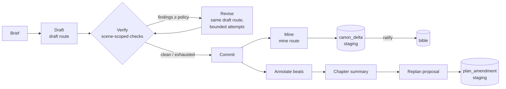

# Spindle evolution — the editorial loop: design & implementation plan

**Status:** design draft (no implementation yet). Every code reference below was verified on
branch `feat/automated` @ `eb3f92f`.
**Mandate:** evolve Spindle from *a story bible the operator feeds* into *an editorial system
that runs the room* — machine-proposed bookkeeping, in-run revision, self-clearing checkpoints,
a living outline, and an operator console — **without losing a single capability that works
today**, and with the **explicit-content offload system preserved and extended** to every new
model pass this design introduces.

Companion docs: `spindle-architecture.md` (current architecture, source of truth),
`authoring-supervisor.md` (current run flow), `continuity-timing-design.md` /
`continuity-quantity-design.md` (the continuity spine this builds on).

> Design rule throughout (inherited from the continuity docs): **additive and optional**.
> Every new column is nullable or defaulted; every new behavior is opt-in per run or per
> config; a project that never opts in behaves exactly as today.

---

## 0. Invariants — the "don't lose" contract

These are testable commitments, not aspirations. Each phase in §6 lists the pinned tests that
enforce them.

- **I1 — Additive public surface.** Every existing MCP tool keeps its name, input, and output
  contract. DTO evolution is `serde(default)`-additive only. Branch and revision workflows are
  public surface (repo convention): docs, tests, and skills move in lockstep with any change.
- **I2 — Hybrid mode is first-class, forever.** The host-drafts-in-chat path
  (`execution.rs:914-1039`) is never degraded to a legacy mode. Every automated pass added by
  this design has a **host fallback**: if no route is configured (or cleared — see I3), the
  supervisor asks the host assistant to perform the pass in-chat, exactly as drafting works in
  hybrid mode today.
- **I3 — The explicit offload system governs every prose-bearing pass.** Today, rating-aware
  routing gates *drafting* (`resolve_route`, `ai.rs:806-822`: `(route_name, normalized_rating)`
  overrides). This design extends the same gate to **all** new passes that receive scene prose
  (mining, revision, line-edit, reader-sim, dual-persona automation). No prose is ever sent to
  a route whose agent does not carry the scene's content rating. Degradation is **skip with an
  honest finding** or **host/manual fallback** — never a silent downgrade to an uncleared
  model. §4 is the full specification.
- **I4 — Canon writes are ratified.** All machine-derived canon (mined facts, promise-status
  suggestions, plan amendments) lands in a staging table and reaches the bible only through an
  explicit apply step. Auto-accept exists only as a per-class, per-project policy the operator
  sets. Default policy: everything staged, nothing auto-applied.
- **I5 — Local-first; SQLite is the single source of truth.** The console (§3.7) is a viewer
  and action surface over the existing service layer — never a second store, never a cloud
  dependency.
- **I6 — Deterministic core, models at the edge.** New model passes follow the existing
  pattern (model-backed deep checks, routed adapters). `spindle-core` stays free of MCP
  transport concerns; public DTOs live in `spindle-core`; MCP parses, invokes services,
  serializes (repo conventions).
- **I7 — The supervisor state machine only grows.** New phases and actions extend
  `NextAction`/`determine_next_action` (`plan.rs:85-121`, `700-788`); existing phase semantics
  (`pending → draft_saved → changes_committed → beats_annotated`) are unchanged. Runs started
  before an upgrade remain resumable.
- **I8 — Honest status semantics.** Any pass that is skipped (no route, rating not covered,
  budget exhausted) must say so in run status, checkpoint reports, and findings. A skipped
  check never reads as a clean check.

---

## 1. Current state — verified (what we build on, what caps us)

### 1.1 Genuine strengths (reuse, don't rebuild)

- **Run state machine.** `authoring_run` / `authoring_run_chapter` / `authoring_run_scene` /
  `authoring_checkpoint` (V0007, V0010) driven by `reconcile_state` + `determine_next_action`
  (`spindle-harness/src/plan.rs:206-271`, `700-788`), with artifacts per scene/chapter/
  checkpoint and resumability.
- **Rating-aware agent routing.** Free-form route names; per-`(route, rating)` override
  resolution with ASCII-lowercase normalization (`ai.rs:806-826`); explicit-draft system-prompt
  appendix (`ai.rs:828-841`); grok-cli adapter with MCP pull (`caller_should_send_brief`,
  `ai.rs:357`) and per-scene `explicit_query` (V0010). Backward-compat pinned by tests
  (`rating_aware_routing_is_backward_compatible_with_single_rule_configs`).
- **Two brief paths.** Host-assembled mega-prompt (`execution.rs:914-1039`) and MCP-pull
  minimal manifest (`execution.rs:1041-1118`).
- **Verification engine.** 22 named checks + 5 Phase-4 validators incl. model-backed deep
  tiers (`service.rs:7453-8837`, `validators.rs`), checkpoint shallow audit + sampling
  (`execution.rs:460-577`), deep-audit gate (`tools.rs:3587-3692`).
- **Propose → review → apply.** Already shipped in the import pipeline
  (`import_extract_entities` → `import_apply_review_decisions`) — the exact interaction
  pattern canon mining needs.
- **Prose→canon extraction primitive.** `extract_canonical_facts_from_scene` exists.
- **Revision primitives.** `revise_generation`, `revise_scene`, revision markers, scene
  versions — built, but not wired into the run loop.
- **HTTP + SSE surface.** `/health`, `/model-routes`, `/events` (SSE), `POST /mcp`
  (`spindle-mcp/src/http.rs`) behind `SPINDLE_HTTP_ADDR`.

### 1.2 Structural caps (why evolution, not accretion)

1. **The bookkeeping economy is inverted.** Promise status, beat links, intensity, try-fail
   cycles, consequence delivery — all manual tool calls. The bible's value scales with exactly
   the work nobody wants to do.
2. **Findings are debt, not directives.** Checks run at checkpoint; findings park for human
   triage; nothing routes back to the drafter. The loop doesn't converge — it accumulates.
3. **The checkpoint is a 4-step manual dance** (deep check → record audit → dual-persona
   reviews → review_checkpoint), which caps how unattended an "automated" run can be.
4. **Plans are static.** Emergent prose reality (an unplanned character that works, a thread
   resolving early) never reconciles back into the outline; drift from plan is only ever an
   error.
5. **Observation is poll-and-read-disk.** `/events` streams only model-route snapshots; run
   progress is `authoring_status` polling plus per-scene artifacts on disk.
6. **The explicit appendix is keyed to one route.** `system_prompt_for_request` applies the
   explicit-drafting appendix only when `route_name == "draft"` (`ai.rs:830`) — correct today,
   too narrow the moment other passes carry explicit prose.

---

## 2. Target architecture

### 2.1 The editorial loop (per scene, agent mode)



Hybrid mode runs the identical loop with the host assistant standing in for any pass that has
no configured/cleared route (I2). The checkpoint sits across chapters exactly as today, with
three policies (§3.3).

### 2.2 Crate deltas

| Crate | Delta |
| --- | --- |
| `spindle-core` | New DTOs: canon deltas, ratification, revision directives, run events, plan amendments, recap export. No transport code (I6). |
| `spindle-adapters` | Miner service, scene-scoped check subset entry point, replan differ, recap builder, new migrations V0022+. |
| `spindle-mcp` | New tools (few, coarse — §3.10); `/events` gains run-event topics; deprecation annotations. |
| `spindle-harness` | The biggest delta: verify/revise phases, checkpoint policy automation, journal emission, replan phase. |
| `spindle-console` | **New.** SvelteKit 5 (runes) static bundle served by the existing HTTP mode; viewer + action surface (§3.7). |

### 2.3 New route roles (config-compatible today)

Route names are free-form strings (`ai.rs:143,173`), so new roles need **zero schema changes**
— they're just new `[[routing]]` entries, resolved through the same rating-aware
`resolve_route`:

| Role (route name) | Pass | Prose-bearing | Fallback chain (I2/I3) |
| --- | --- | :--: | --- |
| `draft` | drafting (existing) | yes | host (hybrid) — unchanged |
| `draft` (reused) | in-run revision | yes | host revises in-chat |
| `mine` | canon mining | yes | `review` route (if cleared) → host → skip+finding |
| `line_edit` | optional line-edit pass | yes | skip (pass is optional) |
| `reader_sim` | cumulative reader persona | yes | `review` route (if cleared) → host → manual sampling (today's flow) |
| `review` | dual-persona/checkpoint automation (existing route name) | yes | host/manual (today's flow) |
| `replan` | plan-amendment proposals | summaries only | `review` → host → skip+finding |

Revision deliberately reuses the `draft` route: the model that wrote the scene revises it,
preserving the explicit-offload guarantee with zero new configuration.

---

> Migration numbers in this section are illustrative; actual numbers are assigned at
> implementation time behind each phase's ADR. (V0022 was subsequently taken by the
> owner-approved thread-audit field bundle; shift references accordingly. The secret-knowledge
> gating subsystem — `secret-knowledge-gating-design.md` — also claims a migration and slots
> between P0 and P1.)

## 3. Subsystem designs

### 3.1 Canon mining & ratification (the inversion)

**Goal:** every committed scene produces *proposed* canon deltas; the operator ratifies diffs
instead of authoring bookkeeping.

**Storage — migration V0022 `canon_delta`:**

```sql
CREATE TABLE canon_delta (
  id TEXT PRIMARY KEY,                -- canon_delta:*
  project_id TEXT NOT NULL,
  branch_id TEXT NOT NULL,
  scene_id TEXT NOT NULL,             -- provenance: the scene this was mined from
  authoring_run_id TEXT,              -- NULL when mined outside a run
  delta_class TEXT NOT NULL,          -- see class table
  target_id TEXT,                     -- existing entity this modifies (NULL = proposes new)
  payload TEXT NOT NULL,              -- typed JSON per class (spindle-core DTO)
  evidence TEXT NOT NULL,             -- quoted prose excerpt (≤ 300 chars, sanitized)
  confidence TEXT NOT NULL,           -- high | medium | low
  status TEXT NOT NULL DEFAULT 'staged',  -- staged | applied | rejected | superseded
  decided_at TEXT, decided_by TEXT,   -- ratification audit
  created_at TEXT NOT NULL, updated_at TEXT NOT NULL
);
```

**Delta classes (v1):** `canonical_fact`, `promise_planted`, `promise_payoff_candidate`,
`promise_reinforced`, `relationship_shift`, `character_state`, `knowledge_learned`,
`beat_annotation` (motif/theme/conflict links + intensity), `try_fail_cycle`,
`consequence_delivered`, `quantity_change`, `entity_candidate` (new character/location/term
proposal). Each class maps to exactly one existing write tool on apply — the miner **never**
invents new write paths.

**Miner service** (`spindle-adapters`): one model call per committed scene through the `mine`
route (rating-gated, §4), prompt = scene prose + the scene's context snapshot + the current
staged/open thread state; output = strict JSON parsed into class DTOs; malformed items
dropped, never guessed. Reuses `extract_canonical_facts_from_scene`'s extraction shape and the
import pipeline's review ergonomics.

**Tools (coarse):**
- `mine_scene_canon { scene_id }` → stages deltas (idempotent: re-mining supersedes prior
  `staged` deltas for the scene).
- `list_canon_deltas { project_id, status?, scene_id?, chapter_range? }`.
- `decide_canon_deltas { decisions: [{delta_id, action: apply|reject, edit?}] }` — apply maps
  each class to its existing write tool inside one transaction per scene; `edit` lets the
  operator amend the payload before apply (ratify-with-correction).

**Run integration:** a new scene phase step after `changes_committed` — `canon_mined` — auto-
executed by `execute_next` like commit/annotate are today (I7: additive `NextAction::MineScene`
variant; existing runs without the phase resume unaffected because `determine_next_action`
treats a NULL/absent mining state as complete for pre-upgrade runs).

**Policy:** `mining_policy` on the run (`propose_all` default; `auto_accept: [classes]` may
list low-risk classes, e.g. `beat_annotation` — applied immediately but still journaled and
reversible via the delta record). I4 holds: default is propose-only.

**Relationship to `authoring_save_scene_draft`'s continuity package:** unchanged and still
required (I1). The miner *pre-fills* the package proposal in agent mode; in hybrid mode the
host may call `mine_scene_canon` and present staged deltas instead of hand-authoring — the
manual path stays valid forever.

### 3.2 In-run verify & revise

**Goal:** findings become revision directives while the drafting context is hot, instead of
checkpoint debt.

- **Scene-scoped verify:** a new service entry point runs the *deterministic* check subset
  relevant to one scene (knowledge_timing, chronology, temporal_coherence lexical tier,
  quantity/currency, canonical_fact_prose_drift, voice_drift, world_rule pattern tier, tone,
  content_boundary) immediately after `draft_saved`. Deep/model tiers stay checkpoint-scoped
  (cost control).
- **RevisionDirective:** findings ≥ `warning` (policy-tunable) are rendered into a bounded
  directive block and the scene returns to the drafter — same route, same rating (I3), same
  brief plus the directive. `authoring_run_scene` gains `revise_attempts INTEGER NOT NULL
  DEFAULT 0` and `last_verify_artifact TEXT` (V0023, additive).
- **Bounds:** `max_revise_attempts` per run (default **1**; 0 = today's behavior, preserving
  I1 semantics for existing configs). A finding kind that survives its revision attempt is
  parked for checkpoint exactly as today — the loop must converge or stop, never oscillate.
  Never re-revise for the same `(check_kind, finding_key)` twice.
- **Hybrid mode:** findings are surfaced to the host in the `execute_next` response
  ("draft has 2 blocking findings — revise and re-save"), making the host the revision agent
  (I2). This is strictly additive information; a host that ignores it proceeds to today's flow.

### 3.3 Checkpoint policies

`authoring_run` gains `checkpoint_policy TEXT NOT NULL DEFAULT 'manual'` (V0023).

| Policy | Behavior |
| --- | --- |
| `manual` (default) | Exactly today's 4-step flow. I1 pinned. |
| `auto_advisory` | Harness runs deep `check_consistency`, records the audit, runs dual-persona reviews for sampled scenes via the `review` route, then **auto-approves iff no finding ≥ `warning`**; otherwise blocks with the full report, exactly like `manual`. |
| `auto_strict` | Auto-approves only on zero findings of any severity. |

Preconditions enforced at `authoring_start_run`: an auto policy requires (a) route preflight
green for `review` across **all content ratings in the run's range** (§4), and (b) the
deep-check model route configured. Otherwise start is rejected with a `missing_requirements`
entry — fail at prepare, not at 2am (I8).

**Explicit-scene sampling rule (offload-critical):** if a sampled scene is `explicit` and the
`review` route's resolved agent for `("review","explicit")` is absent, the harness does **not**
send that scene anywhere else. That scene's review falls back to manual — the checkpoint
blocks listing exactly which scenes await host/manual review, while cleared scenes' reviews
complete automatically. Partial automation, zero leakage.

### 3.4 Run event journal + SSE

**Migration V0024 `authoring_run_event`:** append-only `(id, authoring_run_id, seq INTEGER,
kind TEXT, payload TEXT, created_at)` with `UNIQUE(authoring_run_id, seq)`.

Kinds (v1): `run_started`, `scene_drafted`, `scene_verify_completed`, `scene_revised`,
`scene_committed`, `scene_mined`, `deltas_decided`, `beats_annotated`, `chapter_summarized`,
`replan_proposed`, `checkpoint_created`, `checkpoint_auto_approved`, `checkpoint_blocked`,
`run_blocked`, `run_resumed`, `run_completed`, `pass_skipped` (payload: pass, reason — I8).

The harness emits at each existing transition (pure addition — the journal is written *after*
the state change commits; journal failure never fails the run step, it logs). `/events` gains
`?topic=run:<run_id>` streaming journal rows as SSE with `seq` as the SSE id (client resume
via `Last-Event-ID`). Payloads carry **ids and artifact paths, never prose** — the event
stream must be safe to leave open on a shared screen (offload discipline extends to
observability).

This journal is a **one-way door** (consumers will depend on kinds/payloads): the kind set
and payload shapes above ship behind an ADR before implementation.

### 3.5 Living outline — replan proposals

After `SaveChapterSummary`, a `replan` pass compares realized reality (chapter summary,
key_events, promise events, beat annotations, arc tracker deltas) against the *next* chapters'
plans and stages `plan_amendment` rows (V0025, same staging/status shape as `canon_delta`;
classes: `scene_replace`, `scene_reorder`, `scene_add`, `scene_drop`, `synopsis_update`,
`thread_promote`, `thread_retire`, `promise_followup`). Applying an amendment calls the
existing `plan_chapter`/`set_chapter_outline` write paths with a bumped `plan_revision`
column (V0025, additive) so plan history is preserved and the run's `persisted_scenes` for
*already-drafted* chapters are never mutated. The differ input is summaries + metadata only
(not prose), so the `replan` route needs no rating clearance; the pass is skipped with a
finding when no route resolves (I8). Proposals never auto-apply (I4) — this is the one staging
class where even `auto_accept` policy is not offered in v1.

### 3.6 Craft evaluation

- **`scene_purpose_fulfillment`** (deep check): does the drafted scene accomplish the plan's
  `purpose` field? Model-backed, checkpoint-scoped, findings advisory (`info`/`warning`),
  same honest-skip semantics as `promise_payoff_detection`.
- **Cumulative reader-sim:** a `reader_sim` role that reads chapters *in order with memory* —
  its state is a rolling reviewer-notes artifact per (run, persona) updated at each
  checkpoint, so engagement drift ("13.3 retreads 12.1") is detectable. Output feeds the
  checkpoint report beside dual-persona results. Prose-bearing ⇒ fully rating-gated (§4).

### 3.7 Console (`spindle-console`)

- **v1 (read-only):** compiled manuscript pane (via `compile_manuscript`), thread board
  (promises × chapters, arcs, plot lines, motif density), run timeline (journal SSE), staging
  queues (canon deltas, plan amendments) — all reads through existing HTTP endpoints.
- **v2 (actions):** ratify/reject deltas and amendments, resolve blocked checkpoints, edit
  directives — every action is a call to an existing MCP tool via the shipped `POST /mcp`
  transport. The console never gains its own write path (I5).
- Svelte 5 runes house style; static assets embedded in `spindle-mcp` (served under `/console`
  when HTTP mode is on) so distribution stays a single binary. Localhost-bound by default,
  same as the existing HTTP listener.
- **Prose display note:** the console displays prose the operator already owns, read locally —
  no rating gating applies to *display*; gating governs which *models* see prose, not the
  author.

### 3.8 Reader-facing artifacts

`export_recap { book_number, through_chapter }` → spoiler-safe "previously on" (digest +
paid-promise list truncated at the cursor), and `export_series_bible { through_chapter }` →
glossary/character pages from terms, snapshots, and states at the cursor. Pure read models
over existing data; the spoiler boundary reuses the same placement-cursor filtering the
context assembler already does for future knowledge (`service.rs:6570-6599`).

### 3.9 Style learning from operator edits

When a scene is re-saved with prose that differs from the last agent draft (detectable: the
run stores draft artifacts; the re-save is host/operator-provenance), store the before/after
pair as a `style_example` candidate feeding the **existing** style-profile refresh flow
(`preview_refresh_style_profile` → `refresh_style_profile`). Opt-in per project; candidates
are reviewable before any profile refresh (I4). Explicit-scene edit pairs are stored with the
scene's rating and only ever surfaced to rating-cleared profile-refresh routes (§4).

### 3.10 Surface consolidation

New coarse verbs added in this design: `mine_scene_canon`, `list_canon_deltas`,
`decide_canon_deltas`, `list_plan_amendments`, `decide_plan_amendments`,
`compile_manuscript`, `export_recap`, `export_series_bible` — **8 tools** for the whole
evolution. Nothing is removed. Fine-grained tools that the loop now automates (e.g. manual
`update_promise_status`, `annotate_scene_beats`) get a deprecation *annotation* in their
descriptions pointing at the staged-delta flow, but remain functional indefinitely (I1) —
they are also the apply-targets the miner uses. Skills are rewritten per phase (I8/I1
alignment): `authoring-supervisor` learns policies and staging; `scene-writer` learns the
directive block; a new `canon-steward` skill teaches the ratification workflow.

---

## 4. The explicit-content offload system — preserved and extended

This section is normative. The current system, verified:

- Agents declare `ratings` (e.g. grok-local: `["safe","mature","explicit"]`); routing rules
  may carry a `rating`; resolution tries the `(route_name, normalized_rating)` override before
  the base route (`ai.rs:806-822`); ratings normalize via `trim().to_ascii_lowercase()`
  (`ai.rs:824-826`).
- Explicit drafts get a dedicated system-prompt appendix, currently keyed to
  `route_name == "draft"` && rating `explicit` (`ai.rs:828-841`).
- Run scenes persist `content_rating` and `explicit_query` (V0007/V0010); hybrid mode returns
  non-explicit scenes to the host and routes explicit scenes through the configured explicit
  agent.

**Extension rules (all new passes):**

1. **Prose-bearing is a route property, not a name check.** Replace the hardcoded
   `route_name == "draft"` in `system_prompt_for_request` with a `PROSE_BEARING_ROUTES`
   constant — `{"draft","mine","line_edit","reader_sim","review"}` — so the explicit appendix
   and rating gates apply uniformly. (The narrow check is cap §1.2-6.)
   *(Implementation refinement — landed:* the **gate** applies uniformly to every
   prose-bearing route, but the **appendix** is split: `draft` keeps the drafting directive
   that instructs on-page adult prose, while every other prose-bearing route — miner/auditor —
   gets an *analysis* directive instead. Instructing a miner to write porn would be wrong;
   the invariant is uniform gating, not a uniform prompt. See `EXPLICIT_ANALYSIS_SYSTEM_APPENDIX`
   in `ai.rs`.)
2. **The gate is at dispatch, in one place.** A single `resolve_cleared_route(role, rating)`
   helper wraps `resolve_route` and additionally verifies the resolved agent's `ratings` list
   covers the scene's rating (normalized compare). All harness/service pass dispatch goes
   through it. No call site may resolve a prose-bearing route directly.
   *(Implementation refinement — landed:* the two pre-existing prose-bearing deep tiers that predate the chokepoint — the intra-scene temporal check (`deep_temporal_coherence_issues`) and the semantic world-rule check (`deep_world_rule_compliance_issues`) — now stamp each scene's `content_rating` on their `review` dispatch and honest-skip on `RatingNotCovered` (per-scene pattern, mirroring the secret-leak tier), closing the `rating: None` bypass the offload contract-test agent flagged so an explicit scene's prose can no longer reach a `review` agent that never declared explicit coverage. A generic **transport** error on those tiers now also surfaces honestly — one info finding per run (temporal reports the deep tier skipped; world-rule reports degradation to the deterministic heuristic tier, which still runs) — rather than a silent clean scan. **Decided boundary:** the manuscript-import routes (`import_extract`, `import_synthesize`) are deliberately EXEMPT from `PROSE_BEARING_ROUTES` and thus from the dispatch gate — content ratings do not exist until analysis runs, and import is a direct operator action on their own manuscript, so the guard is informed configuration (a `configure_agents` advisory when the import chair is not explicit-cleared while another agent is), not gating.)*
3. **Degradation ladder, per pass:** cleared role route → cleared `review` route (where the
   table in §2.3 allows) → **host fallback** (hybrid ethos, I2) → **skip + `pass_skipped`
   journal event + finding** (I8). At no point does prose reach an uncleared agent. There is
   no "downgrade the content" branch — Spindle never rewrites an explicit scene to make it
   routable.
4. **Preflight covers every enabled pass.** `authoring_prepare_run` computes the max rating in
   the chapter range and verifies coverage for each pass the run's policies enable (draft +
   revise always; mine/review/reader_sim per policy). Uncovered ⇒ `missing_requirements`
   entries naming pass, rating, and the fallback that will apply — the operator decides
   before the run starts, not during.
5. **Config lint** (`configure_agents`): warn on non-lowercase ratings, unknown rating tokens,
   and duplicate `(route, agent, rating)` bindings. Warn — never mutate (the operator's
   config file is theirs).
6. **Journal/SSE/status carry ids, never prose** (§3.4), so observability surfaces need no
   rating gates.

**Pinned contract test (P2 exit):** an integration run over one `general` + one `explicit`
scene with `mine`/`review` routes resolving only to a non-explicit agent must show: explicit
scene drafts via the explicit-cleared draft agent (as today); its mining and review passes
skip with `pass_skipped` events and honest findings; the general scene's passes complete; no
request containing the explicit scene's prose was dispatched to the uncleared agent (asserted
via a recording fake router).

---

## 5. Compatibility contract — pinned flows

Each flow below has (or gains, in P0) an integration test that must stay green through every
phase. This is the executable form of "don't lose what we can do today."

| # | Pinned flow | Existing anchor |
| --- | --- | --- |
| C1 | Hybrid interactive run: prepare → start → execute_next → host draft → save (with continuity package) → commit → annotate → summary → manual checkpoint | `authoring_supervisor_integration_flow` (`sqlite_integration_tests.rs:392-989`) |
| C2 | Agent-mode explicit scene routes to the rating-override agent; non-explicit host-drafts in hybrid | same test, scenes 1.1/1.2; `rating_aware_routing_resolves_explicit_to_override_agent` |
| C3 | Manual checkpoint 4-step gate (deep audit required, sampled reviews required) | `tools.rs:3587-3692` tests |
| C4 | Single-rule agent configs keep working | `rating_aware_routing_is_backward_compatible_with_single_rule_configs` |
| C5 | Branch create/switch/diff/merge and revision-marker workflows | existing branch/revision tests |
| C6 | Import pipeline end-to-end | existing import tests |
| C7 | `plan_chapter`/`prepare`/`start`/`execute_next`/`save_scene_draft` DTO stability | add serde golden-JSON snapshots (P0) — reviewed diffs only, never blind-accepted |
| C8 | EPUB export + preflight | existing export tests |
| C9 | Pre-upgrade runs resume after migration (a run created at V0021 resumes at V0025) | add in P1: fixture DB snapshot test |

---

## 6. Implementation plan

TDD is non-negotiable throughout (failing test first, per work item). Global gate after every
item: `make validate` (fmt-check + clippy `-D warnings` + workspace tests — mirrors CI). Each
phase ends with a docs+skills alignment item (I1/I8) and a green run of the full pinned-flow
suite (§5).

Sizes: S ≤ ~150 lines · M ≤ ~500 · L larger. Phases are sequential; items within a phase are
parallelizable unless noted.

### P0 — Sensory organs (prerequisites, no new architecture)

The already-ticketed enhancement set (external packet `analysis/spindle/ENHANCEMENTS.md`,
T-101…T-110), restated as scope so this doc is self-contained:

| Item | Scope | Size |
| --- | --- | :--: |
| P0.1 | `book_digest.open_threads` populated + rendered (today hardcoded `[]`, `repository.rs:7685-7727`) | M |
| P0.2 | Hydrate chapter-plan targeted themes/motifs/conflicts/plot-lines into briefing + scene context | L |
| P0.3 | Previous-scene closing excerpt in scene context (char-boundary-safe, budgeted) | M |
| P0.4 | Deterministic thread audits: motif overuse, theme placement, plot-line convergence, arc milestones, escalation order | M×2 |
| P0.5 | `promise_payoff_detection` deep check (propose-only; honest-skip) | L |
| P0.6 | `compile_manuscript` (workspace-confined, placeholders for gaps) | M |
| P0.7 | Route preflight in `prepare_run` + config lint (§4.4-5 foundations) | M |
| P0.8 | Pacing feed-forward into `pacing_directives` | M |
| P0.9 | "Threads to advance" block in both brief paths | S |
| P0.10 | C7 serde golden snapshots + C9 fixture-DB groundwork | M |

**Exit:** pinned suite green; context carries threads; preflight exists; `compile_manuscript`
available (console dependency).

### P1 — Canon mining & ratification

| Item | Scope | Size |
| --- | --- | :--: |
| P1.1 | **ADR:** canon_delta classes + payload schemas (one-way door) | S |
| P1.2 | Migration V0022 + `canon_delta` repository/DTOs; supersede-on-remine semantics | M |
| P1.3 | Miner service: prompt, strict parse, class mapping; recording-fake-router tests; `resolve_cleared_route` helper + `PROSE_BEARING_ROUTES` (§4.1-2) | L |
| P1.4 | Tools: `mine_scene_canon`, `list_canon_deltas`, `decide_canon_deltas` (apply maps to existing write tools, single transaction per scene, edit-before-apply) | L |
| P1.5 | Run phase `canon_mined` (`NextAction::MineScene`; pre-upgrade-run compatibility per I7; C9 test) | M |
| P1.6 | `mining_policy` on start_run (`propose_all` default; `auto_accept` classes) | S |
| P1.7 | Docs (`authoring-supervisor.md`, agent-config) + skills (`canon-steward`, supervisor update) | M |

**Exit:** an agent-mode run stages deltas for every committed scene; nothing auto-applies by
default; explicit scenes mine only through cleared routes (offload contract test from §4
introduced here against the miner, completed in P2 for review passes); C1–C9 green.

### P2 — Verify/revise + journal

| Item | Scope | Size |
| --- | --- | :--: |
| P2.1 | Scene-scoped deterministic check subset entry point (reuses existing check impls) | M |
| P2.2 | RevisionDirective + bounded revise (V0023 columns; `max_revise_attempts` default 1; oscillation guards; hybrid surfacing) | L |
| P2.3 | **ADR:** journal kinds/payloads (one-way door), then V0024 + emission at all transitions (journal-write-never-fails-the-step) | M |
| P2.4 | `/events?topic=run:<id>` SSE with seq resume; ids-not-prose payloads | M |
| P2.5 | Full §4 offload contract integration test (recording fake router; skip events; honest findings) | M |
| P2.6 | Docs + skills alignment | S |

**Exit:** findings ≥ warning trigger one in-run revision; a run is watchable over SSE; the §4
pinned contract test green.

### P3 — Checkpoint policies + craft

| Item | Scope | Size |
| --- | --- | :--: |
| P3.1 | V0023 `checkpoint_policy` + start-run preconditions (route coverage incl. per-rating review, §3.3) | M |
| P3.2 | `auto_advisory`/`auto_strict` harness automation (deep check, audit record, dual-persona via `review` route); explicit-scene manual-fallback sampling rule | L |
| P3.3 | `scene_purpose_fulfillment` deep check | M |
| P3.4 | `reader_sim` role + rolling reviewer-notes artifact, checkpoint report integration | L |
| P3.5 | Docs + skills alignment | S |

**Exit:** a grok run with `auto_advisory` clears clean checkpoints unattended and blocks with
full reports otherwise; explicit-only-manual fallback verified; `manual` remains the default
and byte-identical to today (C3).

### P4 — Living outline

| Item | Scope | Size |
| --- | --- | :--: |
| P4.1 | **ADR:** amendment classes; then V0025 (`plan_amendment`, `plan_revision`) | M |
| P4.2 | Replan differ + `replan` pass after chapter summary (summaries-only input; skip+finding when unrouted) | L |
| P4.3 | `list_plan_amendments` / `decide_plan_amendments` (apply via existing plan write paths; drafted chapters immutable) | M |
| P4.4 | Docs + skills alignment | S |

**Exit:** an accepted amendment changes the *next* chapter's drafting without touching
completed ones; plan history queryable by revision.

### P5 — Console + reader artifacts + style learning

| Item | Scope | Size |
| --- | --- | :--: |
| P5.1 | `spindle-console` crate v1 read-only (manuscript, thread board, run timeline via SSE, staging queues); embedded static serving under `/console` | L |
| P5.2 | Console v2 actions via `POST /mcp` (ratify, decide, resolve blocks) | L |
| P5.3 | `export_recap` + `export_series_bible` (cursor-bounded spoiler safety) | M |
| P5.4 | Style-delta capture → style-refresh candidate flow (opt-in; rating-tagged) | M |
| P5.5 | Docs + skills alignment | S |

### P6 — Consolidation

Deprecation annotations on superseded fine-grained tools (functional forever, I1); skills
rewrite completion; `spindle-architecture.md` updated to describe the editorial loop as
current architecture; this document is then superseded by it (house rule: docs/ stays
current-material).

---

## 7. Risk register

| Risk | Mitigation |
| --- | --- |
| **Miner precision too low** → ratification queue becomes noise | Ship propose-only; measure acceptance rate per class from `decided_*` audit fields; disable classes below threshold by default; confidence labels surfaced in the queue |
| **Revise-loop oscillation / cost creep** | `max_revise_attempts` default 1; never re-revise same finding key; per-run model-call budget with `pass_skipped(reason: budget)` events (I8) |
| **Journal schema is a one-way door** | ADR before P2.3; payloads carry ids + artifact paths only, so evolution pressure lands on artifacts, not events |
| **Rating leakage via a new pass** | Single dispatch chokepoint (`resolve_cleared_route`), `PROSE_BEARING_ROUTES` constant, and the §4 recording-fake contract test pinned in CI from P2 onward |
| **Auto-checkpoint erodes trust** | `manual` default; `auto_advisory` blocks on any ≥ warning; every auto-approval writes the same full report artifact a manual review would |
| **Console scope creep** | v1 strictly read-only; every v2 action must be an existing MCP tool call; no console-only endpoints |
| **Surface bloat** (200 tools today) | Hard cap: this whole design adds 8 tools; everything else rides existing verbs |
| **Pre-upgrade runs break on migration** | C9 fixture-DB resume test from P1; all run-table changes defaulted |

## 8. Open decisions (owner)

1. `auto_accept` default classes for mining — recommend `[]` (none) for v1; revisit with
   acceptance-rate data.
2. Should `agent`-mode runs default `checkpoint_policy` to `auto_advisory` once P3 ships?
   (Recommend: yes, with `manual` remaining the global default.)
3. Reader-sim persona definitions (how many, whose voice) — product taste, not architecture.
4. Console packaging: embedded assets (recommended, single binary) vs separate crate binary.
5. Whether `line_edit` ships at all in v1 or waits for style-learning data (recommend: wait).
